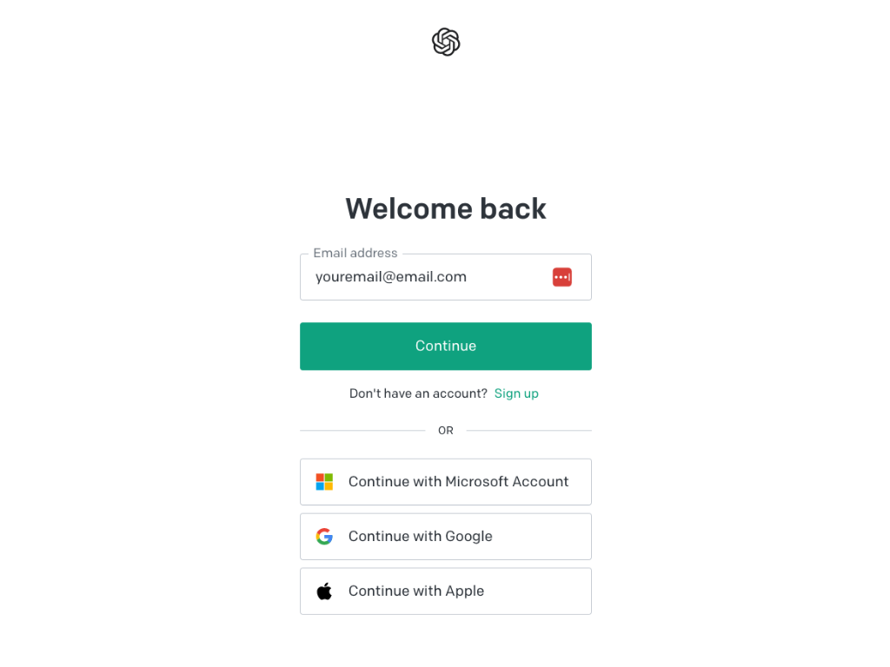
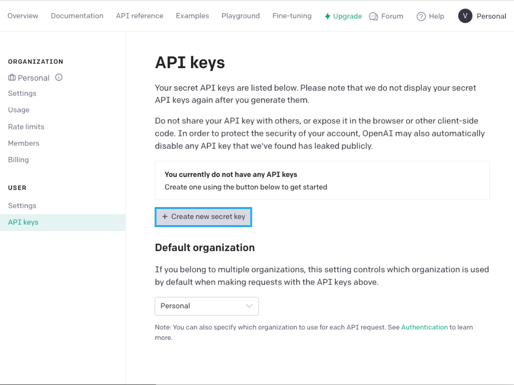
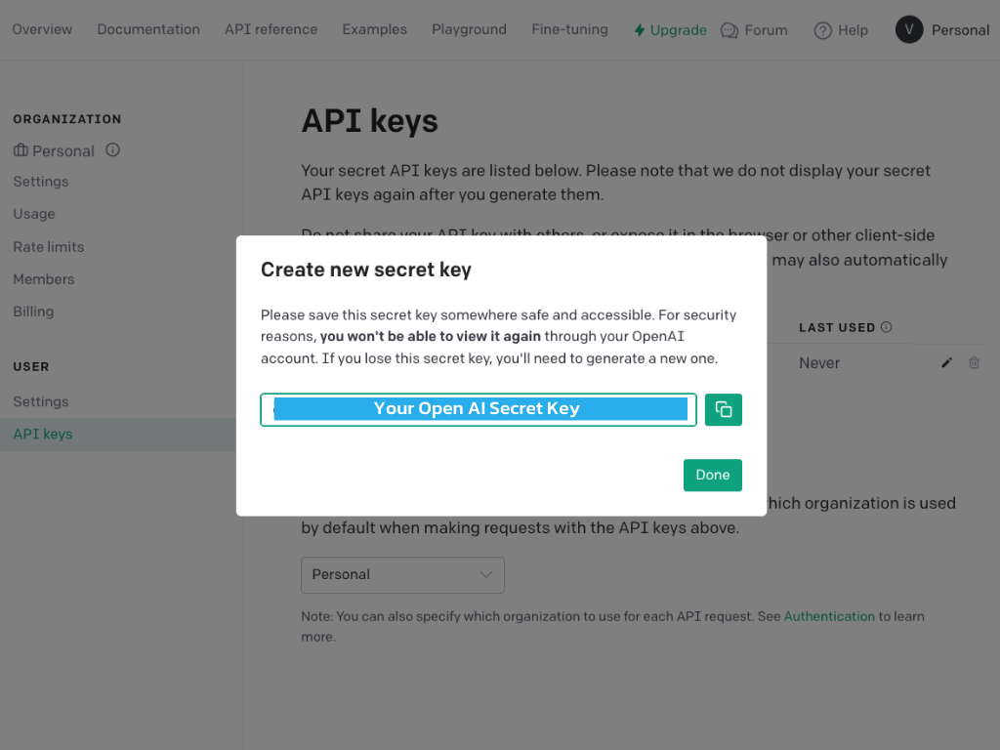
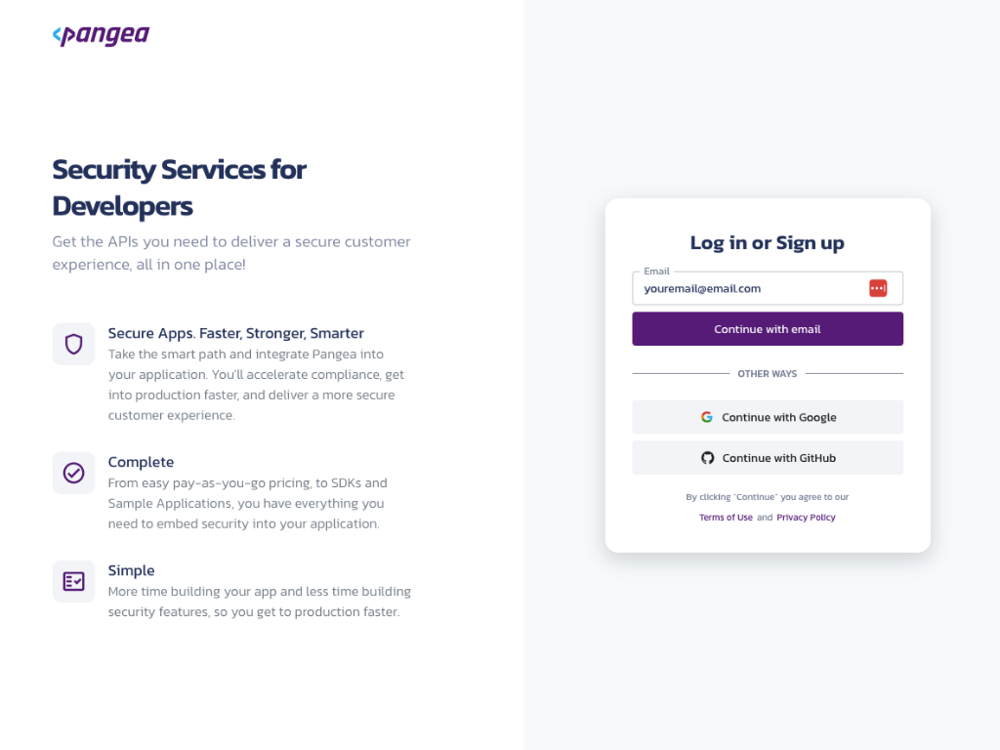
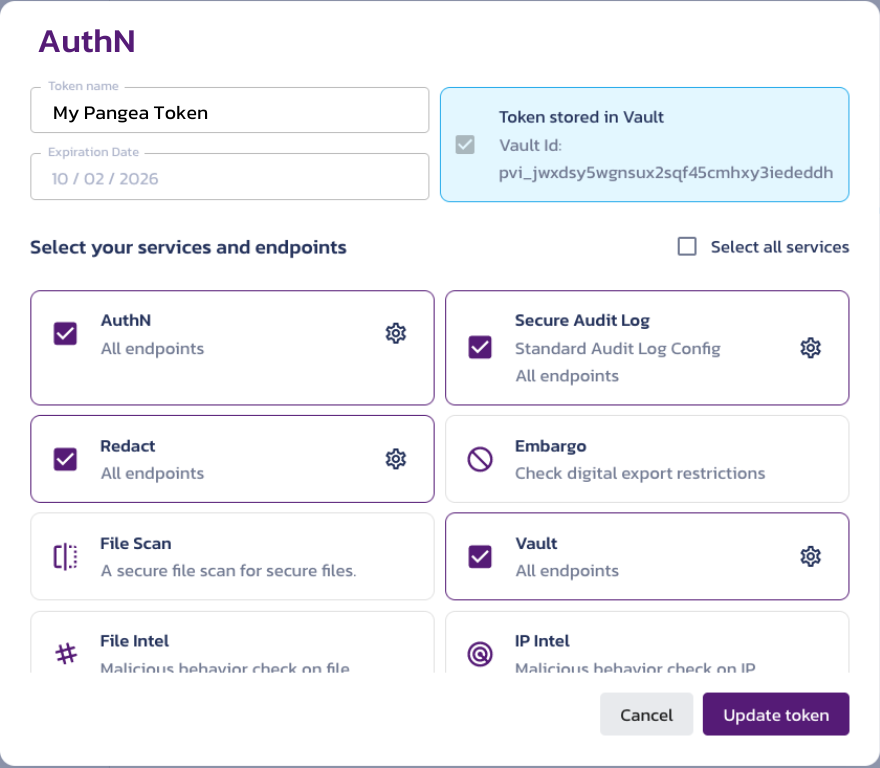
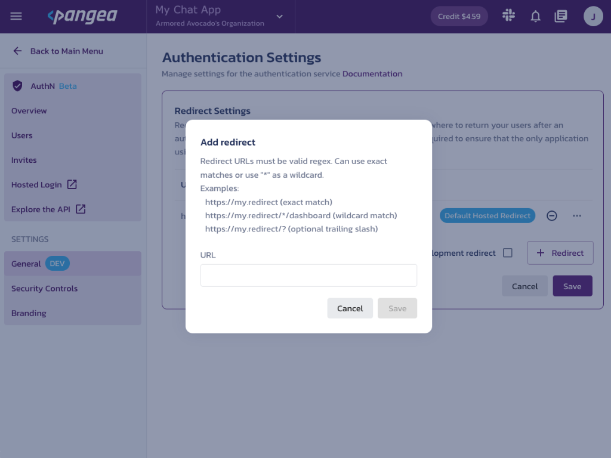

# Secure ChatGPT
## Overview
This app simulates the chatGPT experience with additional security features. It uses Pangea's robust set of security APIs such as:
- [PII redaction](https://pangea.cloud/services/redact?utm_source=github&utm_medium=secure-chagpt) of the user prompts
- [Audit logging](https://pangea.cloud/services/secure-audit-log?utm_source=github&utm_medium=secure-chagpt) the user prompts in their redacted form
- [Authentication](https://pangea.cloud/services/authn/?utm_source=github&utm_medium=secure-chagpt) to access the ChatGPT dashboard to prevent malicious actors

We also use OpenAI's advanced ChatGPT API to create a more secure version of the familiar chatGPT experience.

This codebase was built using [NextJS's ChatBot template](https://github.com/vercel/ai-chatbot?ref=pangea.cloud), [Pangea's APIs](https://pangea.cloud/?utm_source=github&utm_medium=secure-chagpt), and [Open AI's GPT API](https://openai.com/product?ref=pangea.cloud).

## Getting Started

  * [Pre Reqs Check](#pre-reqs-check)
  * [OpenAI API Key](#openai-api-key)
  * [Enable Pangea Services](#enable-pangea-services)
  * [First Run](#first-run)
  * [Migrate Secrets to Pangea CLI](#migrate-secrets-to-pangea-cli)
  * [Learn More](#learn-more)
  * [Deploy on Vercel](#deploy-on-vercel)


## Pre Reqs Check
In order to run this application you are going to need:
 - Node
 - OpenAI
 - Pangea Account

## OpenAI API Key
 If you are comfortable using a credit card, follow these instructions below.

 1. Create an account to sign in to [OpenAI](https://openai.com)


2. Once signed in, [this link](https://platform.openai.com/account/api-keys) will begin the flow to create an API Token.

3. Name your token.
4. Copy the API Key and save it somewhere. We will not be able to access it again.


## Enable Pangea Services
1. Create and sign into your [Pangea account](https://l.pangea.cloud/SecurechatgptRepo)


2. Once you land on the Pangea User Console, You can see AuthN, Secure Audit Log, Redact, and Vault on the left.

3.  Select **AuthN** to enable and begin the token creation process. While creating the token, you can enable it for all the services we are going to require for this application: AuthN, Redact, Secure Audit Log, and Vault.


4. Landing on the **AuthN Service Overview** page you'll see all the token information you will need from Pangea to run the application. Copy these values into a note pad or keep this page open.

5. Go to the Redirects tab and add the necessary redirect. If running this in codespace, it's the url of your codespace running instance.
If running this app locally, add http://localhost:3000 to the redirect list. This is also go to a good time to go to General Settings and decide what methods of Login or MFA you need for your application. On first run it is recommended to do this in a bare bones way.



> NOTE: By going to **Customize > View project branding**, you'll be able to customize your login page

6. Go to back to the **Main Menu** and then navigate to **Redact > Rulesets**. This is where you will be able to configure what gets redacted and how. For the demo, it's recommended that we enable redaction for:
    - PII: email address and phone number
    - US Identification Numbers: US Social Security Number

7. Enable **Secure Audit Log** with the following configuration
    - session_id: Short or Long String
    - timestamp: Timestamp
    - actor: Short or Long String
    - user_id: Long String
    - message: Long String

> NOTE: You find find this configured in src>lib>auditLog.ts

## First Run

1. Copy the appropriate values into the .env file.
    - OPEN AI API Token
    - Pangea Service Token
    - Pangea Domain
    - Pangea AuthN Client Token
    - Pangea Hosted Login URL

2. Let's run the development server:

```bash
npm run dev
# or
yarn dev
# or
pnpm dev
```

Open [http://localhost:3000](http://localhost:3000) with your browser to see the result.

You can start editing the page by modifying `pages/index.tsx`. The page auto-updates as you edit the file.

[API routes](https://nextjs.org/docs/api-routes/introduction) can be accessed on [http://localhost:3000/api/hello](http://localhost:3000/api/hello). This endpoint can be edited in `pages/api/hello.ts`.

The `pages/api` directory is mapped to `/api/*`. Files in this directory are treated as [API routes](https://nextjs.org/docs/api-routes/introduction) instead of React pages.

This project uses [`next/font`](https://nextjs.org/docs/basic-features/font-optimization) to automatically optimize and load Inter, a custom Google Font.

## Migrate Secrets to Pangea CLI
If you wanted to get rid of the .env code, we can leverage the Pangea CLI to migrate the secrets to the Pangea Vault. Then when we run the application, the we will pull down the appropriate secrets from the Pangea Vault. Remember to **enable Vault** in your Pangea User Console.

For the full documentation please go the the [Pangea CLI github](https://github.com/pangeacyber/pangea-cli)

Login to the Pangea CLI

 ```
pangea login –no-browser
```

Next we create a folder within the Vault to hold our application's secrets
```
pangea create​
```

Then we migrate the secrets in our .env file to the new folder in the Pangea Vault
```
pangea migrate -f .env​
```

Now in order to run the application, we add 'pangea run -c' before the command in order to pull down the secret values.
```
pangea run -c npm run dev
```


## Learn More

To learn more about Next.js, take a look at the following resources:

- [Next.js Documentation](https://nextjs.org/docs) - learn about Next.js features and API.
- [Learn Next.js](https://nextjs.org/learn) - an interactive Next.js tutorial.

You can check out [the Next.js GitHub repository](https://github.com/vercel/next.js/) - your feedback and contributions are welcome!

## Deploy on Vercel

The easiest way to deploy your Next.js app is to use the [Vercel Platform](https://vercel.com/new?utm_medium=default-template&filter=next.js&utm_source=create-next-app&utm_campaign=create-next-app-readme) from the creators of Next.js.

Check out our [Next.js deployment documentation](https://nextjs.org/docs/deployment) for more details.
