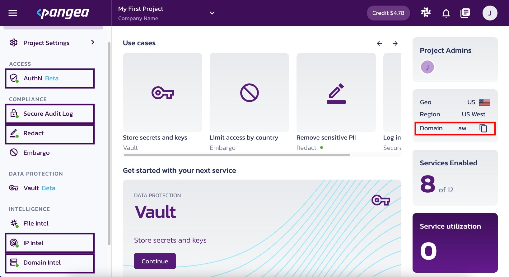
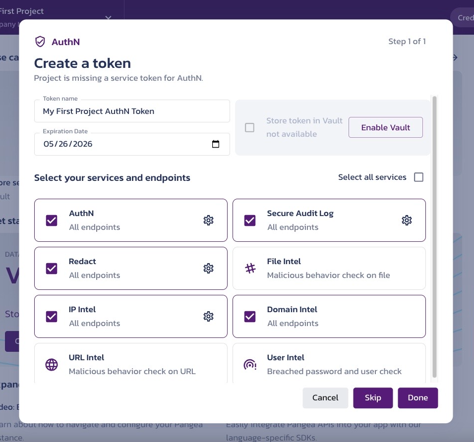
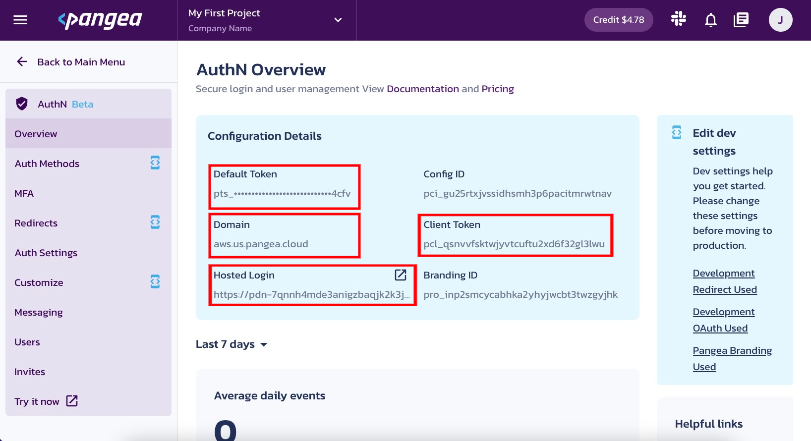

# secure-chatgpt

The goal of this boilerplate is to show how developers can use Pangea's various services to secure their own ChatGPT implementation.

We are using the following Pangea services:

- **Auth Service**: To add authentication to a NextJS App and prevent unauthenticated users from using ChatGPT
- **Redact Service**: To redact sensitive information from the user's prompt before the entry reaches to OpenAI API
- **Audit Service**: To audit the user prompts
- **Reputation/Threat Intel services**: To detect and neutralize the malicious URLs and domain names in the OPENAI API's responses. 

For more indepth information please go to our blog about [protecting PII from ChatGPT models](https://pangea.cloud/docs/blog/trusting-gpt-protecting-apps-from-pii-leakage)

# Setup

## Pre Reqs Check
In order to run this application you are going to need: 
 - Node
 - OpenAI
 - Pangea Account

## OpenAI API Key
1. Create an account ot sign in to [OpenAI](https://openai.com)
2. Once sign in, [this link](https://platform.openai.com/account/api-keys) will begin the flow to create an API Token.
3. Name your token.
4. Cope the API Key and save it somewhere. We will not be able to access it again. 


## Enable Pangea Services
1. Create and sign in to your [Pangea account](https://console.pangea.cloud/)

2. Once your land on the Pangea User Console, You can see AuthN, Secure Audit Log, Redact, IP Intel, and Domain Intel on the left. Note that the Domain is shown on the right and will be needed when we run the application.


3. Select **AuthN** to enable and begin the token creation process. While creating the token, you can enable it for all the services we are going to require for this application: AuthN, Redact, IP Intel, Secure Audit Log, and Domain Intel.



4. Landing on the **AuthN Service Overview** page you'll see all the token information you will need from Pangea to run the appliction. Copy these values into a note pad or keep this page open



5. Go to the **Redirects** tab and add http://localhost:3000` to the redirect list.

> NOTE: By going to **Customize > View project branding**, you'll be able to customize your login page

6. Go to back to the **Main Menu** and then navigate to **Redact > Rulesets**. This is where you will be able to configue what gets redacted and how. For the demo, it's reccomended that we enable redaction for:
    - PII: email address and phone number
    - US Identification Numbers: US Social Security Number


## Setup App & Run
During the generator script, you will need the following information ready:

- **OpenAI API Key**: If you haven't done so, please head over to the OpenAI site and register a user and get an API Key for using OpenAI services https://platform.openai.com/account/api-keys
- **Pangea Service Token**: Go to Pangea Console and create a service token that has access to AuthN, Redact, URL Intel, File Intel, and Audit services https://console.pangea.cloud/
- **Pangea Domain**: This is visible in the project settings at Pangea Console
- **Pangea AuthN Client Token and URL**: Located in the AuthN settings of your project at Pangea Console, and copy the Authn Client Token, Hosted Login URL.

Now that you have the necessary information to go thru the setup

1. Run the following command, and enter the required information when you are prompted.

```
    npx create-secure-chatgpt-app
```
2. Input the appropriate token values


3. Now you can `cd` into the newly generated app directory and run

```
    npm run dev
```

4. If everything went well, you should be able to open a browser and navigate to 

```
http://localhost:3000
``` 
